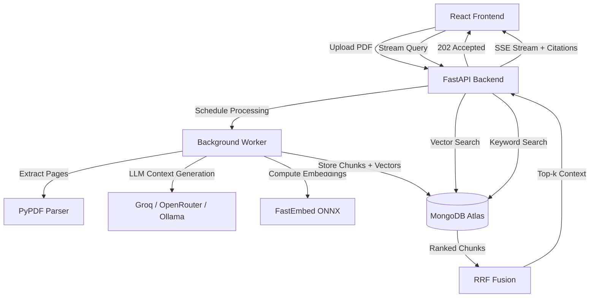

# AskPDF: Deep Document Intelligence RAG Engine


AskPDF is an advanced **Retrieval-Augmented Generation (RAG)** system that lets you upload any PDF and have a real conversation with it. It implements state-of-the-art **Contextual Retrieval** (pioneered by Anthropic) and a **Hybrid Vector + Keyword Search pipeline with Reciprocal Rank Fusion** to deliver highly precise answers with page-level citations.

The system features a fully async **FastAPI** backend, a **MongoDB Atlas / local-fallback hybrid vector store**, and a polished **Claude-inspired React frontend** with real-time SSE streaming and click-to-preview PDF citations.

---

## 📺 Demo


<video src="video/rag.mp4" width="100%" controls></video>


---

## 🚀 Key Technical Highlights

### 1. Hybrid Retrieval with Reciprocal Rank Fusion (RRF)
*   **The Problem:** Pure vector search misses exact keyword matches (names, codes, IDs). Pure keyword search misses semantic meaning. Using only one gives poor recall.
*   **The Solution:** The query pipeline runs **vector search and keyword/lexical search simultaneously** via `asyncio.gather()`, then merges the two ranked result lists using **Reciprocal Rank Fusion (RRF)** — a proven re-ranking algorithm that rewards chunks appearing highly in *both* lists. This produces dramatically better top-k retrieval than either method alone.

### 2. Anthropic-Style Contextual Retrieval
*   **The Problem:** Standard chunking splits documents arbitrarily, causing chunks to lose context (e.g., a chunk mentions "Q3 revenue" but loses track of *which company* or *which year*).
*   **The Solution:** During ingestion, the system generates a comprehensive document summary, then uses an LLM to write a 1–2 sentence **situational context** for every single chunk (e.g., *"This chunk discusses Q3 revenue figures from the 2025 Microsoft Annual Report."*). This context is prepended to the chunk before embedding, massively improving retrieval precision.

### 3. Multi-Tier Search Fallbacks (Zero Lock-in)
The search pipeline gracefully degrades across environments — no Atlas account? No problem:

| Tier | Vector Search | Keyword Search |
|------|--------------|----------------|
| **Cloud (Atlas)** | `$vectorSearch` aggregation | `$search` (Atlas Search) |
| **Local Fallback** | In-memory cosine similarity (pure Python) | MongoDB `$text` index |
| **Last Resort** | — | Regex term matching with word scoring |

### 4. Multi-Provider LLM & Embedding (Factory Pattern)
*   The entire LLM orchestration layer is provider-agnostic via a `get_llm_client()` factory — switch between providers by changing a single `.env` variable.
*   **Groq API:** Ultra-fast cloud inference (Llama 3.3 70B Versatile)
*   **OpenRouter API:** Free-tier open-source models (Llama, Nemotron, etc.)
*   **Ollama (Local/Offline):** 100% free, runs entirely on your machine — no API key needed

### 5. CPU-Accelerated Local Embeddings (No GPU Required)
*   Uses **FastEmbed** (ONNX Runtime) with `BAAI/bge-small-en-v1.5` (384-dim) for fast, accurate local embeddings — no PyTorch, no CUDA, no 2GB model downloads. The backend stays ~150MB.
*   CPU-heavy embedding is offloaded via `asyncio.to_thread()` so the async server never blocks.

### 6. Real-Time Streaming with Source Citations
*   Answers stream token-by-token from the LLM directly to the browser via **Server-Sent Events (SSE)**.
*   Source citations (page numbers + similarity scores) are returned in the `X-Sources` response header and rendered as clickable badges that open an **inline PDF preview** at the exact cited page.

---

## 🛠️ System Architecture



---

## 💻 Tech Stack

### **Backend**
| | Tool | Purpose |
|---|---|---|
| 🐍 | **FastAPI** | Async ASGI web framework |
| 🔗 | **LangChain** (`core`, `groq`, `openai`, `ollama`) | LLM provider abstraction |
| 🧠 | **FastEmbed** (BAAI/bge-small-en-v1.5) | Local ONNX-accelerated embeddings |
| 🍃 | **MongoDB + Motor** | Async vector & document store |
| 📄 | **PyPDF** | PDF text & metadata extraction |
| ⚡ | **asyncio** | Concurrent search, rate-limit semaphores, thread delegation |

### **Frontend**
| | Tool | Purpose |
|---|---|---|
| ⚛️ | **React 19** | UI framework |
| ⚡ | **Vite** | Build tool & dev server |
| 🎨 | **Tailwind CSS v4** | Utility styling with custom CSS variables |
| 🌙 | **Dark Mode (default)** | Claude-inspired warm dark theme, persisted via localStorage |
| 🖼️ | **Lucide React** | Icon library |

---

## ⚙️ Configuration & Setup

### Prerequisites
- Python 3.11+
- Node.js 18+
- MongoDB (local) **or** a free [MongoDB Atlas](https://www.mongodb.com/cloud/atlas) cluster
- A free API key from [Groq](https://console.groq.com/) **or** [OpenRouter](https://openrouter.ai/) — **or** use Ollama for fully offline mode

### **Backend Setup**
```bash
cd backend

# 1. Create virtual environment
python -m venv .venv
.venv\Scripts\activate        # Windows
# source .venv/bin/activate   # macOS/Linux

# 2. Configure environment
cp .env.example .env
# Edit .env: add your MONGODB_URI and GROQ_API_KEY (or others)

# 3. Install dependencies
pip install -r requirements.txt

# 4. Run server (auto-reloads on file save)
python run.py
# → API running at http://localhost:8000
# → Swagger docs at http://localhost:8000/docs
```

### **Frontend Setup**
```bash
cd frontend

# 1. Install dependencies
npm install

# 2. Start dev server
npm run dev
# → App running at http://localhost:5173
```

### **MongoDB Atlas Vector Index (for cloud setup)**
If using Atlas, create two search indexes on the `chunks` collection:

**Vector Index** (name: `vector_index`):
```json
{
  "fields": [{
    "type": "vector",
    "path": "embedding",
    "numDimensions": 384,
    "similarity": "cosine"
  }]
}
```

**Search Index** (name: `search_index`): use the default dynamic mapping.

> **Local MongoDB users:** No extra setup needed. The system automatically falls back to in-memory cosine similarity and `$text` index search.

---

## 🔑 Environment Variables

Copy `backend/.env.example` to `backend/.env` and fill in your values:

| Variable | Required | Description |
|---|---|---|
| `MONGODB_URI` | ✅ | MongoDB connection string (`mongodb://localhost:27017` or Atlas SRV) |
| `GROQ_API_KEY` | If using Groq | Free at [console.groq.com](https://console.groq.com/) |
| `OPENROUTER_API_KEY` | If using OpenRouter | Free at [openrouter.ai](https://openrouter.ai/) |
| `LLM_PROVIDER` | ✅ | `groq`, `openrouter`, or `ollama` |
| `EMBEDDING_PROVIDER` | ✅ | `local` (recommended) or `ollama` |
| `GENERATE_SITUATIONAL_CONTEXT` | ❌ | `true` to enable Contextual Retrieval (slower ingestion, better answers) |
| `CLEAR_DB_ON_STARTUP` | ❌ | `false` recommended — wipes DB on every restart if `true` |

---

## 📁 Project Structure

```
RAG_PDF/
├── backend/
│   ├── app/
│   │   ├── main.py           # FastAPI app, lifespan, CORS, routes
│   │   ├── config.py         # Pydantic settings loaded from .env
│   │   ├── database.py       # Motor async MongoDB client & index init
│   │   ├── routes/
│   │   │   ├── document.py   # Upload, list, delete, PDF serve endpoints
│   │   │   └── query.py      # Hybrid search + SSE streaming endpoint
│   │   ├── services/
│   │   │   ├── pdf_service.py     # PyPDF extraction + custom text splitter
│   │   │   ├── vector_service.py  # Embeddings, vector/keyword search, RRF
│   │   │   └── llm_service.py     # LLM factory, context gen, stream gen
│   │   └── schemas/
│   │       ├── document.py   # DocumentOut Pydantic model
│   │       └── query.py      # QueryRequest Pydantic model
│   ├── .env.example
│   ├── requirements.txt
│   └── run.py
└── frontend/
    └── src/
        ├── App.jsx                    # Root state, polling, layout
        └── components/
            ├── Navbar.jsx             # Brand, connection status, theme toggle
            ├── DocumentUpload.jsx     # Drag-drop upload, contextual toggle
            ├── DocumentList.jsx       # Knowledge base sidebar, progress badges
            └── ChatInterface.jsx      # SSE streaming chat, source inspector
```

---

## 🤝 Contributing

Pull requests are welcome. For major changes, please open an issue first to discuss what you would like to change.

---

*Built with ❤️ as a deep-dive into production RAG architecture.*
