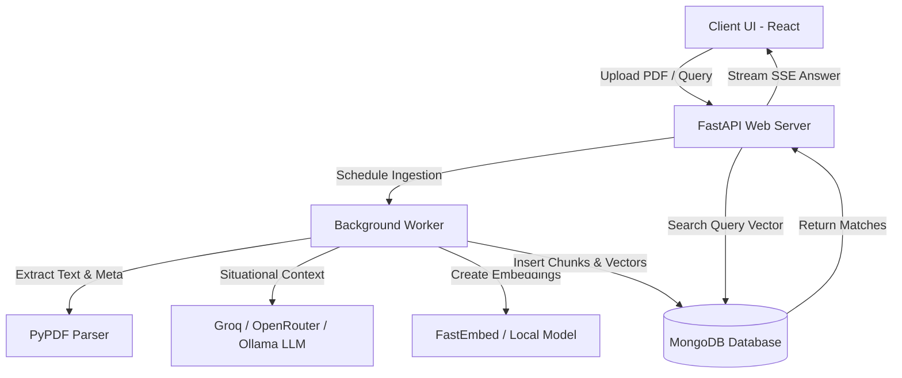

# AskPDF: Deep Document Intelligence RAG QNA Engine

AskPDF is an advanced, production-ready Retrieval-Augmented Generation (RAG) system built to ingest, index, and query unstructured PDF documents. This engine implements state-of-the-art **Contextual Retrieval** concepts (pioneered by Anthropic) to resolve chunk-context loss, resulting in highly precise semantic search recall and page-level source citation.

The system features an asynchronous **FastAPI backend** utilizing thread-pool delegation for CPU-heavy tasks, a **MongoDB Atlas / local fallback hybrid vector store**, and a polished, low-glare **Claude-style React frontend** supporting real-time Server-Sent Events (SSE) streaming answers and click-to-preview PDF citations.

---

## 🚀 Key Technical Highlights (What Interviewers Care About)

### 1. Anthropic-Style Contextual Retrieval
*   **The Problem:** Standard chunking splits documents arbitrarily (e.g., 500-token chunks), causing key semantic context to be lost (e.g., losing track of which company, department, or year a financial chunk refers to).
*   **The Solution:** During ingestion, the system first generates a comprehensive summary of the entire document. When splitting the document into overlapping chunks, an LLM generates a 1-2 sentence **situational summary** for each chunk (e.g., *"This chunk discusses Q3 revenue figures, situated within the 2025 Microsoft financial report"*). This context is prepended to the chunk before embedding, boosting retrieval accuracy and citation precision.

### 2. Multi-Provider LLM & Local Fallback Options
*   The LLM orchestration layer is completely decoupled from individual API clients using LangChain and a custom factory configuration pattern.
*   **Groq API:** Leverages ultra-fast cloud inference (Llama 3/Mixtral).
*   **OpenRouter API:** Integrates free-tier open-source models with automatic real-time markdown stripping and leading whitespace cleaning for a plain-text UI.
*   **Ollama (Local/Offline):** Integrates standalone `langchain-ollama` to run models (like Llama 3.2 3B) locally on your device for 100% free, unlimited execution.

### 3. CPU-Accelerated Local Embeddings
*   Uses **FastEmbed** (running on ONNX Runtime) to compute vector embeddings locally (`bge-small-en-v1.5`) rather than relying on heavy PyTorch/PyTorch-CUDA dependency stacks. This keeps the backend server container lightweight (~150MB instead of ~2GB).

### 4. Hybrid Vector Retrieval Pipeline
*   **MongoDB Atlas Vector Search:** Executes native vector queries in the cloud via a `$vectorSearch` aggregation stage with pre-filtering capability.
*   **Zero-Config Local Fallback:** Automatically falls back to an in-memory, mathematical cosine similarity algorithm written in pure Python if Atlas credentials are not provided.

---

## 🛠️ System Architecture



---

## 💻 Tech Stack

### **Backend**
*   **Framework:** FastAPI (Asynchronous ASGI server)
*   **LLM Integration:** LangChain Core, `langchain-openai` (OpenRouter), `langchain-groq`, `langchain-ollama`
*   **Local Embeddings:** `fastembed` (BAAI/bge-small-en-v1.5)
*   **Database:** MongoDB (Motor client for async database calls)
*   **PDF Processing:** PyPDF

### **Frontend**
*   **Library:** React 19 (Hooks, custom context wrappers)
*   **Build Tool:** Vite
*   **Styles:** Tailwind CSS v4 (Custom CSS variables)
*   **Theme:** Claude-inspired Warm Light & Dark theme with local storage persistence
*   **Icons:** Lucide React

---

## ⚙️ Configuration & Setup

### **Backend Setup**
1. Navigate to the backend directory:
   ```bash
   cd backend
   ```
2. Create and configure your environment variables:
   ```bash
   cp .env.example .env
   ```
   Add your keys (`MONGODB_URI`, `GROQ_API_KEY`, `OPENROUTER_API_KEY`).
3. Install dependencies:
   ```bash
   pip install -r requirements.txt
   ```
4. Run the development server:
   ```bash
   python run.py
   ```

### **Frontend Setup**
1. Navigate to the frontend directory:
   ```bash
   cd frontend
   ```
2. Install dependencies:
   ```bash
   npm install
   ```
3. Start the Vite server:
   ```bash
   npm run dev
   ```
4. Access the web app at `http://localhost:5173`.
