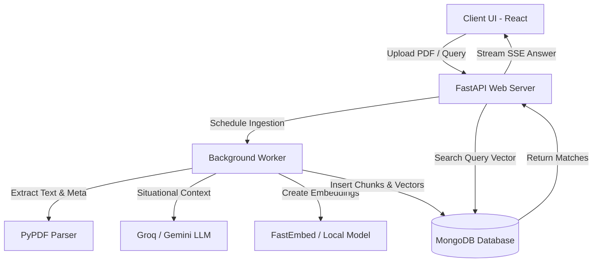

# Contextual Retrieval RAG PDF Engine

An advanced, production-ready Retrieval-Augmented Generation (RAG) system built to extract, index, and query information from PDF documents. This project implements state-of-the-art **Contextual Retrieval** concepts (pioneered by Anthropic) to maximize retrieval recall and precision.

The system features a **FastAPI backend** utilizing asynchronous task queues and threads to prevent event loop bottlenecks, a **MongoDB Atlas / Local fallback vector store**, and a highly-polished, low-glare **Claude-inspired React frontend** with persistent theme toggles.

---

## Key Technical Highlights (What Interviewers Care About)

### 1. Anthropic-Style Contextual Retrieval
* **The Problem:** Standard chunking splits documents arbitrarily (e.g., 500-token chunks), causing key semantic context to be lost (e.g., losing track of which company or year a financial chunk refers to).
* **The Solution:** During document ingestion, the system first generates a comprehensive summary of the entire document. When splitting the document into overlapping chunks, an LLM generates a 1-2 sentence **situational summary** for each chunk (e.g., *"This chunk discusses Q3 revenue figures, situated within the 2025 financial report"*). This context is prepended to the chunk before embedding, boosting retrieval accuracy and citation precision.

### 2. High-Performance Asynchronous Ingestion & Concurrency Throttling
* **Non-Blocking CPU Operations:** Embedding calculation and metadata extraction are CPU-intensive. To prevent blocking the FastAPI main ASGI thread, the system offloads synchronous tasks to an external worker thread pool using `asyncio.to_thread`.
* **Rate-Limit Resiliency:** The background worker generates situational chunk contexts concurrently. To prevent hitting token-per-minute (TPM) limits on free-tier APIs (Groq/Gemini), requests are throttled using an `asyncio.Semaphore(5)` limit. A global fallback flag automatically aborts pending summaries and proceeds with standard RAG ingestion if a HTTP `429` Rate Limit is encountered.

### 3. Smart Hybrid Vector Retrieval Pipeline
* **MongoDB Atlas Vector Search:** In production environments, the engine executes vector queries natively in the cloud database via a `$vectorSearch` aggregation stage with pre-filtering capability.
* **Zero-Config Local Fallback:** For local development without Atlas indices, the service automatically falls back to an in-memory, mathematical cosine similarity algorithm written in pure Python.

### 4. Asynchronous Chat Streaming & Citations
* Chat answers are streamed chunk-by-chunk to the client using Server-Sent Events (SSE).
* Ingested document references are linked dynamically; the backend calculates similarity scores and parses source page numbers, returning them in custom headers (`X-Sources`) to provide click-to-preview PDF annotations.

---

## 🛠️ System Architecture



---

## 💻 Tech Stack

### **Backend**
* **Framework:** FastAPI (Asynchronous ASGI server)
* **LLM Engine:** Groq API (Llama 3 / Mixtral) / Gemini API
* **Local Embeddings:** `fastembed` (BAAI/bge-small-en-v1.5)
* **Database:** MongoDB (Motor client for async database calls)
* **PDF Processing:** PyPDF
* **Task Management:** FastAPI BackgroundTasks

### **Frontend**
* **Library:** React 19 (Hooks, custom context wrappers)
* **Build Tool:** Vite
* **Styles:** Tailwind CSS v4 (Custom CSS theme variables)
* **Theme:** Claude-inspired Warm Light & Dark theme with local persistence
* **Icons:** Lucide React

---

## ⚙️ Configuration & Setup

### **Backend Setup**
1. Navigate to the backend directory:
   ```bash
   cd backend
   ```
2. Create and configure your environment variables:
   ```bash
   cp .env.example .env
   ```
   Add your keys (`MONGODB_URI`, `GROQ_API_KEY`, `GEMINI_API_KEY`).
3. Install dependencies:
   ```bash
   pip install -r requirements.txt
   ```
4. Run the development server:
   ```bash
   python run.py
   ```

### **Frontend Setup**
1. Navigate to the frontend directory:
   ```bash
   cd frontend
   ```
2. Install dependencies:
   ```bash
   npm install
   ```
3. Start the Vite server:
   ```bash
   npm run dev
   ```
4. Access the web app at `http://localhost:5173`.
