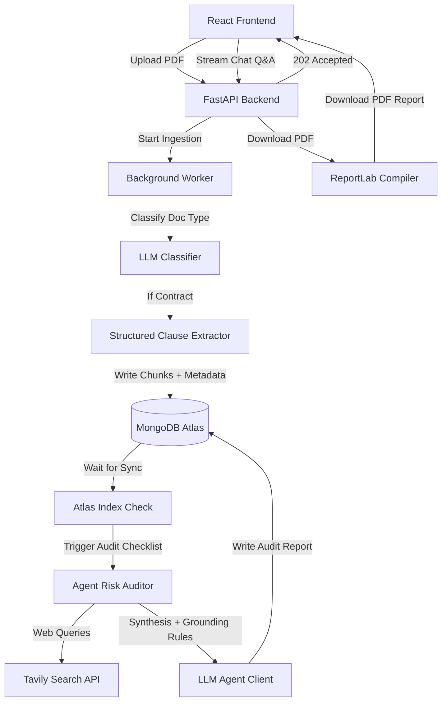

# BREACH: AI-Powered Contract Risk Auditor & Q&A Agent


[](LICENSE)

BREACH is an agentic, production-grade **Retrieval-Augmented Generation (RAG)** system and legal contract risk auditor. It classifies uploaded documents, automatically extracts and catalogs contractual clauses, evaluates key legal risk categories (e.g., Liability, Indemnity, Confidentiality, Intellectual Property) using structured LLM checklists, fetches real-world precedents/compliance guidance from the web via **Tavily Search**, compiles a **Safety Score**, and outputs a polished, downloadable **PDF Audit Report**.

The app integrates a fully async **FastAPI** backend, a **MongoDB Atlas Vector Store** with dynamic indexing checks, and a polished **Claude-inspired React workspace** with a tabbed interface toggling between the interactive Compliance Audit Dashboard and the Sara AI Q&A Assistant.

---

## 🚀 Key Technical Highlights

### 1. Document Type Classification & Guardrails
*   **The Problem:** Users might upload non-contract documents (invoices, receipts, policies), causing RAG engines to hallucinate risk reports for documents that lack contractual clauses.
*   **The Solution:** The pipeline runs a **structured document classifier** (`classify_document`) on the first ~600 words. If the file is not a binding legal agreement (e.g., NDA, Employment Contract, Service Deed), it registers the classification details, halts risk analysis, and triggers a clean, professional **"Document Not Analysable"** warning panel in the frontend with zero hallucinated risks.

### 2. Page-by-Page Structured Clause Extraction
*   **The Problem:** Traditional RAG chunking splits text arbitrarily (e.g. by character count), tearing clauses apart and missing references, causing the LLM to lose track of clause boundaries.
*   **The Solution:** BREACH parses pages into structured, self-contained clause objects (with exact text quotes, page numbers, and legal category mappings). These structured clauses are persisted directly in MongoDB as top-level searchable entities.

### 3. Predefined Risk Discovery Checklist
*   **The Problem:** Standard vector search is search-dependent: if the user doesn't ask the right question, critical risks might be missed.
*   **The Solution:** The agent executes a systematic, parallelized **10-point legal checklist check** (scanning for Liability Caps, Indemnification, Governing Law, Non-Compete, IP Assignment, etc.). It analyzes each category against the extracted clauses to ensure exhaustive auditing coverage.

### 4. Live Precedent Queries via Tavily Search
*   When a risk is flagged, the agent dynamically compiles search queries to fetch real-world legal precedents, court rulings, or statutory regulations relevant to the contract category (e.g., matching the clause with relevant Indian or Global corporate case law). Search results are referenced in the report citation drawer.

### 5. MongoDB Atlas Search & Vector Index Syncing
*   Ingestion processes check the status of Atlas Search and Vector indexes dynamically via `wait_for_atlas_indexing` before launching the agentic audit loop. This eliminates race conditions during bulk uploads where vector searches are shot before Atlas finishes building the search indexes.

### 6. Dynamic PDF Report Compilation
*   Compiles a printable compliance summary with a custom ReportLab PDF compiler. Includes a styled, color-coded risk severity matrix (Red for High Risk, Yellow for Warning, Green for Low Risk), original clause citations, and negotiation rewrite recommendations.

---

## 🛠️ System Architecture



---

## 💻 Tech Stack

### **Backend**
*   **FastAPI**: Async web server framework.
*   **LangChain & Structured JSON**: Pydantic outputs, factory client selectors (Groq, OpenRouter, Ollama).
*   **ReportLab**: Programmatic PDF compilation and page styling.
*   **Tavily Search API**: Live web indexing of case law and precedents.
*   **FastEmbed (BAAI/bge-small-en-v1.5)**: Fast, local CPU-accelerated embeddings.
*   **MongoDB + Motor**: Async DB driver and hybrid search.
*   **SlowAPI**: Rate limiting on upload/query endpoints to protect paid LLM & Tavily calls from abuse.

### **Frontend**
*   **React 19 & Vite**: Fast development server and rendering.
*   **Tailwind CSS & CSS Variables**: Clean Claude-inspired styling.
*   **Lucide React**: Vector icon library.

### **Infra**
*   **Docker**: Multi-stage Dockerfiles for both services; `docker-compose.yml` for one-command local stacks (backend + frontend + MongoDB).
*   **GitHub Actions**: CI runs backend tests (pytest), linting (ruff), frontend linting/build, and a Docker build check on every push.
*   **Render**: Blueprint (`render.yaml`) for one-click cloud deployment.

---

## ⚙️ Configuration & Setup

### Prerequisites
*   Python 3.11+
*   Node.js 18+
*   MongoDB (local) or a [MongoDB Atlas](https://www.mongodb.com/cloud/atlas) cluster.
*   An API key from **Groq** (free tier Llama 3.3 70B), **Tavily**, and optional cloud providers.
*   [Docker Desktop](https://www.docker.com/products/docker-desktop/) — only needed for the Docker workflow below.

### Option A — Run with Docker (recommended, fastest)

This spins up MongoDB, the FastAPI backend, and the React frontend together with one command — no local Python/Node setup needed.

```bash
# 1. Configure backend secrets
cp backend/.env.example backend/.env
# Edit backend/.env and fill in GROQ_API_KEY / TAVILY_API_KEY
# (leave MONGODB_URI as-is — docker-compose points it at the mongo container)

# 2. Build and start everything
docker compose up --build

# → Frontend:  http://localhost:5173
# → Backend:   http://localhost:8000
# → Health:    http://localhost:8000/health
```

Stop the stack with `docker compose down` (add `-v` to also wipe the MongoDB volume).

### Option B — Run natively

**Backend**
```bash
cd backend

# 1. Create virtual environment
python -m venv .venv
.venv\Scripts\activate        # Windows
# source .venv/bin/activate   # macOS/Linux

# 2. Configure environment
cp .env.example .env
# Edit .env and append keys:
# MONGODB_URI=mongodb+srv://... (or local localhost URI)
# GROQ_API_KEY=gsk_...
# TAVILY_API_KEY=tvly_...

# 3. Install dependencies
pip install -r requirements.txt

# 4. Run server
python run.py
# → API running at http://localhost:8000
```

**Frontend**
```bash
cd frontend

# 1. Install dependencies
npm install

# 2. Start dev server
npm run dev
# → App running at http://localhost:5173
```

---

## 🔑 Environment Variables

Copy `backend/.env.example` to `backend/.env` and fill in:

| Variable | Required | Description |
|---|---|---|
| `MONGODB_URI` | ✅ | MongoDB connection string |
| `GROQ_API_KEY` | ✅ | Free at [console.groq.com](https://console.groq.com/) |
| `TAVILY_API_KEY` | ✅ | Free at [tavily.com](https://tavily.com) |
| `LLM_PROVIDER` | ✅ | `groq`, `openrouter`, or `ollama` |
| `GENERATE_SITUATIONAL_CONTEXT` | ❌ | Set to `true` to enable Anthropic-style Contextual Retrieval |
| `CLEAR_DB_ON_STARTUP` | ❌ | Set to `true` to clear database documents on start |

The frontend reads `VITE_API_URL` (see `frontend/.env.example`) — the deployed backend's base URL, including the `/api` suffix. Vite bakes this in at build time.

---

## 🧪 Testing & CI

Every push/PR to `main` runs three GitHub Actions jobs (see [`.github/workflows/ci.yml`](.github/workflows/ci.yml)):

| Job | What it checks |
|---|---|
| `backend` | `ruff check` + `pytest` (config parsing, route registration, schema validation) |
| `frontend` | `eslint` + `vite build` |
| `docker` | Both Dockerfiles actually build |

Run the same checks locally:
```bash
# Backend
cd backend
pip install -r requirements-dev.txt
ruff check app tests
pytest -v

# Frontend
cd frontend
npm run lint
npm run build
```

---

## 🚢 Deployment (Render)

The backend deploys as a **Docker web service**; the frontend deploys as a **static site** (Vite bakes `VITE_API_URL` in at build time, so a static build — not a generic runtime container — is the standard, free way to host it on Render). `render.yaml` at the repo root defines both.

1. Push this repo to GitHub (see below).
2. In the [Render Dashboard](https://dashboard.render.com/), click **New → Blueprint**, and select this repo. Render reads `render.yaml` and provisions `breach-backend` (Docker) and `breach-frontend` (static site) automatically.
3. Fill in the secrets Render prompts for on the backend service: `MONGODB_URI` (an [Atlas](https://www.mongodb.com/cloud/atlas) connection string — Render's free tier has no attached database), `GROQ_API_KEY`, `TAVILY_API_KEY`.
4. Once both services are live, update two values to match their real `.onrender.com` URLs (Render assigns these on first deploy, so this is a one-time fixup):
   - `breach-backend`'s `CORS_ORIGINS` env var → the frontend's URL
   - `breach-frontend`'s `VITE_API_URL` env var → the backend's URL + `/api`, then trigger a manual redeploy of the frontend so the new value gets baked into the build.

Want the frontend containerized too? `frontend/Dockerfile` + `nginx.conf.template` are included and used by `docker-compose.yml` for local testing — flip `breach-frontend` in `render.yaml` to `env: docker` with `dockerfilePath: ./frontend/Dockerfile` if you'd rather run it that way (it'll no longer be on Render's free static tier).

---

## 📄 License

[MIT](LICENSE) © Pranav Mandani
